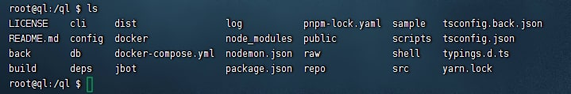
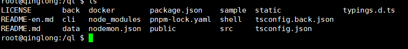

# TG群 https://t.me/intiidea 前期脚本经常修复，建议加群(仅个人建议)

# 根据变量运行对应任务

#### 本脚本配置是根据 https://github.com/whyour/qinglong 的配置进行的，如使用一键脚本，自行修改配置文件

## 并不需要拉取KR库大部分脚本名称都是一样的，只有个别的库可能不同

## 特别声明

```text
域名九月份到期，到期后此脚本将更换新域名
获取参数的脚本暂时不开源，因为很多脚本在不断更新变量不会一直不变
有问题可以 https://t.me/intiidea 群组联系
脚本暂时没有完善守护进程可能有时候会掉，请一段时间查看下日志脚本是否运行
需要其他功能的可以反馈添加，或者反馈脚本BUG问题
有如果有其他获取参数的可以反馈给我添加
有的脚本本人使用的库可能没有，可以反馈给我添加到库里面(有变量那种)
脚本15分钟只能运行相同脚本一次，主要不清楚怎么判断脚本是否在运行，就设置了脚本间隔是15秒
```

本脚本存在风险，使用此脚本默认接受下列风险

```text
1. 此脚本可能会导致您的账户被盗，请谨慎使用，在conn.yml中需要配置你的青龙IP:port + Client ID + Client Secret,如果我在脚本添加可以发送这些内容的信息，那么偷盗你们的ck什么都将不是问题
2. 只要我在获取数据那个网址添加我想运行的青龙脚本，那么只要是使用这个脚本的用户使用的青龙上有脚本与之匹配，那么就会运行这个脚本
3. 可能会添加一些对我个人有益的变量让你们跑，而你们没有收益，所以请谨慎使用
4. 可能还有其他的风险，请自行考虑
5. 使用此脚本产生的任何后果将与本人无关，请承担考虑
6. 变量来自 https://t.me/KingRan521 频道 京东脚本仓库地址 https://github.com/KingRan/KR，应该有人用过这个仓库，我看反馈有如下
    A: 发现东东萌宠提现到非本人账号
    B: 领现金被其他人提了
    C: 锦鲤每天都被用掉了，非本人使用
    D: 赚京豆脚本偷助力
    E: 被偷CK
    F: 等等问题
不放心变量或者脚本的可以不使用，暂时用的库只有KR
7. 如果后期所有东西丢失或者其他问题请勿找本人负责
```

<details>
  <summary>废话内容</summary>
  <pre><code> 
> 变量来自 https://t.me/KingRan521 频道 京东脚本仓库地址 https://github.com/KingRan/KR
> 如果用过之前写的青龙代理脚本的，应该没有发生过脚本偷你们东西的情况吧
> 不过使用此脚本有可能真的会帮我助力一些任务，或者可能发起组队任务，不过和本人有关的不会损害你们京东利益问题，或者无关紧要的东西，不会让你们运行推一推和挖宝助力这种分你们肉吃的脚本，不过我懒的搞，这个github号虽然只是存放一些垃圾脚本的，不过我也不会想看到有人反馈本人偷你们ck之类的反馈
> 写此脚本只是因为我需要用这个和青龙代理那个不同，
> 后端获取TG值放在了docker容器上了，懒得研究京东这一套，可能一直不会有你们被白嫖的一天
> 因为TG机器人没办法向普通用户一样关注频道只能我专门写个获取TG网页版的爬虫，很多是国内服务器就是给你们大部分也不能爬TG，等那个脚本写的差不多完善了，会开源出来给你们，很多只有在自己手里才完全安全，我这样艰信
> CK我去年被偷了，但是使用了抓CK的APP和KR的加密脚本，并不知道是什么原因导致被偷，所以我非常理解自己白嫖京东被别人白嫖的感受
> 日志里面添加了运行的脚本和日志，你们可以在东西丢失后对比日志，就是我也不能跳过日志偷你们东西
> 脚本只有get请求和put请求，不懂的可以百度这两个请求作用
  </code></pre>
</details>


### conn.yml配置详情

```txt
第2行·青龙版本2.13.X写13其他版本以此类推
第4行 登录青龙面板-->系统设置-->应用设置-->新建应用，选择定时任务的权限就行，复制Client ID
第5行 登录青龙面板-->系统设置-->应用设置-->新建应用，选择定时任务的权限就行，复制Client Secret
第7行不用管，但是不能删这一行或者移动
第9行 默认127.0.0.1:5700 就行
第11行 是我搭建获取TG中KR信息的网址，九月会域名到期，可能不定期更换
第13行 是青龙配置文件的路径 默认/root/ql/config/config.sh 容器运行 改成 如果容器有data目录(11版本好像有)添加这个/ql/data/config/config.sh 如果没有data目录(10版本没有)添加/ql/config/config.sh
第15行 不修改，此行不能移动或者更改，否则会删除错误你们青龙配置文件
第17行 日志输出路径
第19行 判断是否有异常不用管
第21行 青龙的数据库 
    > 下面是官方青龙的配置，可能会和部分青龙版的目录有差异
    > 11以后版本/root/ql/db/database.sqlite 容器运行 改成 /ql/data/db/database.sqlite
    > 10.3版本之后定义为10版本 /root/ql/db/crontab.db 容器运行 改成 /ql/db/crontab.db
    > 10.2版本之前定义为9版本 /root/ql/db/crontab.db 容器运行 改成 /ql/db/crontab.db
第23行 判断是有去重，0是去重复，1是不去重复，默认是0
第25行 用于去重的数据库，不用管，如果更改目录需要去相关目录移动数据库文件
第27行记录 7、5、19行的
```

## 在服务器运行脚本，推荐使用

```shell
# 下载添加参数的脚本
  # 国内
  wget https://hub.0z.gs/xgzk/QL_variable/archive/refs/heads/main.zip
  # 国外
  wget https://github.com/xgzk/QL_variable/archive/refs/heads/main.zip
# 解压
unzip main.zip
# 删除
rm -rf main.zip
# 进入QL_variable-main
cd QL_variable-main/
# 修改conn.yml文件，编辑模式按i 写完英文输入法按ESC :qw
vim conn.yml
# 安装依赖库
pip3 install -r requirements.txt
# 测试脚本是否正常
python3 ql_addvalue.py
# 添加守护进程
python3 ql_kill.py
# 结束守护进程！！！ 执行脚本会停止运行
ps -ef|grep ql_addvalue.py |grep -v grep|awk '{print $2}'|xargs kill -9

# 重启脚本
python3 ql_kill.py
```

## 在青龙容器运行脚本

## [找 自动添加参数](https://www.youtube.com/playlist?list=PLH5cFwS6-yF-yDy-eGA3nVVa-2Nl43ZKk)

#### 老版本青龙执行指令

如果容器ql目录是这样执行这个命令


```shell
# 进入青龙的挂载目录，大部分都是ql
cd /root/ql/db
# 下载添加参数的脚本
  # 国内
  wget https://hub.0z.gs/xgzk/QL_variable/archive/refs/heads/main.zip
  # 国外
  wget https://github.com/xgzk/QL_variable/archive/refs/heads/main.zip
# 解压
unzip main.zip
# 删除
rm -rf main.zip
# 进入QL_variable-main
cd QL_variable-main/
# 修改conn.yml文件，编辑模式按i 写完英文输入法按ESC :qw
vim conn.yml
# 查看容器别名,NAMES下的值就是容器的别名
docker ps
# 进入容器
docker exec -it qinglong /bin/bash
# 进入data目录
cd db/QL_variable-main/
# 安装pip3库
pip3 install -r requirements.txt
# 启动脚本
python3 ql_addvalue.py
# 执行
pm2 start qlAddV.yml
# 结束脚本执行 !!!! 不用脚本才用的的，用了会停止脚本
pm2 delete ql_addvalue
# 退出容器 ctrl+p+q

# 重启脚本相关，好像pm2会自动重启，不清楚只是听说
# 查看脚本ID ql_addvalue就是
pm2 list
# 重启 获取输入的ID pm2 restart 3
pm2 restart ID
```

#### 新版本青龙执行指令



```shell
# 进入青龙的挂载目录，大部分都是ql
cd /root/ql/
# 下载添加参数的脚本
  # 国内
  wget https://hub.0z.gs/xgzk/QL_variable/archive/refs/heads/main.zip
  # 国外
  wget https://github.com/xgzk/QL_variable/archive/refs/heads/main.zip
# 解压
unzip main.zip
# 删除
rm -rf main.zip
# 进入QL_variable-main
cd QL_variable-main/
# 修改conn.yml文件，编辑模式按i 写完英文输入法按ESC :qw
vim conn.yml
# 查看容器别名,NAMES下的值就是容器的别名
docker ps
# 进入容器
docker exec -it qinglong /bin/bash
# 进入data目录
cd data/QL_variable-main/
# 安装pip3库
pip3 install -r requirements.txt
# 启动脚本
python3 ql_addvalue.py
# 执行
pm2 start qlAddV.yml
# 结束执行 !!!! 不用脚本才用的的，用了会停止脚本
pm2 delete ql_addvalue
# 退出容器 ctrl+p+q

# 重启脚本相关，好像pm2会自动重启，不清楚只是听说
# 查看脚本ID ql_addvalue就是
pm2 list
# 重启 获取输入的ID pm2 restart 3
pm2 restart ID
```

## 活动相关

```text
活动抓取的是KR的频道，如果有其他地方也有活动参数和链接也可以反馈我添加进去
活动链接类似如下
    > ## CJ组队瓜分-jd_cjzdgf.js
    > export jd_cjhy_activityId="bede6cabc9e74240998d25baf0a6fc10"
    > https://cjhy-isv.isvjcloud.com/wxDrawActivity/activity/367921?activityId=420206514a03469490639d99c206a73f
```

## 关于参数和获取参数网址

参数网址

```text
http://cs.xgz.buzz/ql/jd.json 测试配置是否正确，替换conn.yml中的http://xr.xgz.buzz:5000/qlcs就行，仅用于测试
http://xr.xgz.buzz:5000 确定网址是否正常运行
http://xr.xgz.buzz:5000/qlcs TG上一些活动参数，正式接口，日常使用这个
http://xr.xgz.buzz:5000/qljs 里面脚本名称
http://xr.xgz.buzz:5000/qlurl 一些参数
http://xr.xgz.buzz:5000/qlrz 脚本运行的日志很乱
```

## 更新说明

```text
版本1.1 
 > 修复不同版本数据库差异问题
 > 添加去重功能
 > BUG未知，请遇到反馈
版本1.1.1
    > 修复重复提示不清楚问题
    > 增加请求次数，由原来一次请求失败，现在可以最多请求三次，只要成功一次，就不再请求了
    > 优化活动参数重复提醒
版本1.1.2
    > 适配了特别10.2版本，把10.2之前包括10.2定义为9版本
```
